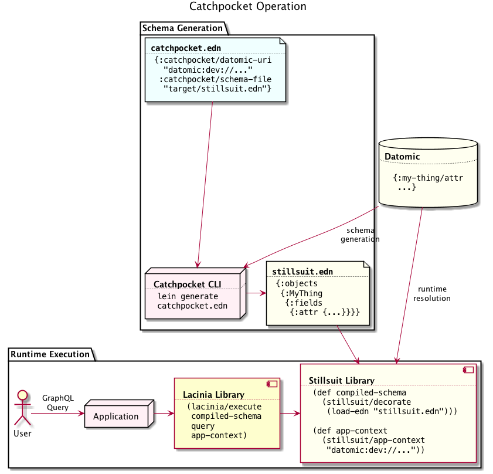

catchpocket is a tool to automatically generate
[lacinia](https://github.com/walmartlabs/lacinia) schema information
from a [datomic](http://www.datomic.com/) database. The schemas it
generates work with the [stillsuit](https://github.com/workframers/stillsuit)
library at runtime to resolve GraphQL queries against the database.

catchpocket is in alpha and it is possible the API and config formats will change.

## Setup

catchpocket depends on the datomic libraries being installed locally. To do so:

- Download datomic from [my.datomic.com](https://my.datomic.com/downloads)
- Unzip it somewhere
- From the root of that folder, run `bin/maven-install` to install the
  client libraries in your local repository.

See also the [instructions at datomic.com](https://docs.datomic.com/on-prem/integrating-peer-lib.html#maven-setup).

You can run catchpocket from leiningen (via `lein run`) or from the Clojure
command-line tools from [tools.deps.alpha](https://github.com/clojure/tools.deps.alpha)
(via `clojure -m catchpocket.main`).

## Running

Catchpocket takes the path to an EDN configuration file as its main parameter.

```
clojure -m catchpocket.main ./doc/samples/mbrainz.edn
```

The configuration file specifies what database to connect to, and what file
to produce as output; see
[the files in `doc/sample`](https://github.com/workframers/catchpocket/tree/develop/doc/samples)
for some examples.

### Testing it out

See the [stillsuit-sample](https://github.com/workframers/stillsuit-sample)
project for some instructions on quickly setting up `graphiql` for a datomic
database.

## Documentation

Documentation is still pretty sparse, sorry, but we want to improve it.
Once it's ready, the user manual will be online
[here](http://docs.workframe.com/catchpocket/current/manual/).

See also [these slides](http://docs.workframe.com/catchpocket/current/slides/)
for a brief talk about stillsuit and catchpocket.

## How does it work?

catchpocket inspects a datomic database and gets metadata about its attributes;
it then inspects its data to do a bit of inference about how to map entity data
to lacinia schema information. It then generates a lacinia schema configuration.
At runtime, the schema can be used with the `stillsuit` library to execute
queries against the database.



catchpocket works by making a bunch of assumptions about the way your data
is set up that may not be true (and are conventions datomic doesn't enforce):

- It assumes that every entity has a distinct namespace, so that a `:user`
  entity has `:user/id` and `:user/name` attributes, but not an
  `:address/postal-code` attribute.
- It assumes that attribute refs always point to the same type of entity.

These assumptions are probably incorrect for many datomic databases. You can
configure catchpocket's operation via the config file to ameliorate some
of the resulting problems.

## Configuration

catchpocket reads its configuration from two primary sources.

- A config file (in EDN)
- Optionally, metadata in the datomic database itself can be attached to
  attributes to tell catchpocket what sort of lacinia schema to generate
  from them.

## Output

When it's finished, catchpocket generates an EDN file which can then be used
as a lacinia schema.

Because many datomic primitives are not directly supported in GraphQL,
catchpocket currently assumes that you will use the
[stillsuit](https://github.com/workframers/stillsuit) library in conjunction
with the generated schema in order to provide some default resolvers for
references and other datomic types.

## Similar projects

The [umlaut](https://github.com/workco/umlaut) project works off of a graphql
schema as its primary input, and is then capable of generating a datomic schema
from the schema, along with specs, graphviz diagrams, and a bunch of other
cool stuff. Where catchpocket is database-first, umlaut is document-first.

### Why "catchpocket"?

In Frank Herbert's _Dune_ novels, a catchpocket is a place where precious water
is stored.

# License

Licensed under Apache 2.0 license, see LICENSE. Copyright (c) 2018 Workframe.

# TODO:
- Security / predicates on attributes
- Inference
- Inject session (/logged-in user) API
- Attach stillsuit and run queries
- Handle empty enum scans correctly (currently breaks lacinia spec)
